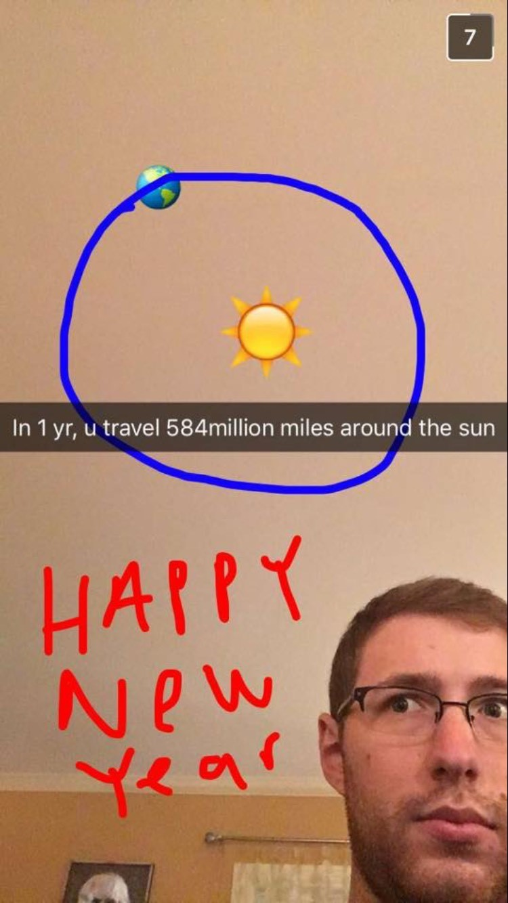

Originally from New Haven, Connecticut I first became fascinated in physics and astronomy
from watching science channel documentaries on the space race. Always wanting to be
an astronaut, I've been chasing the stars ever since, but safely from the ground. 

#### education

Bachelors in physics and applied mathematics - Vanderbilt University 2016

#### a table of me
  
|          likes          |     dislikes      |    neutrals     |
|:------------------------|:------------------|:----------------|
| baseball                | untoasted bagels  | blue pens       |
| Bruce Springsteen       | neon colors       | mice            |
| wwii history books      | chalk             | lemon           |
| ice tea + lemonade      | bananas           | phone calls     |
| the prestige            | wasps             | legal pad paper | 

#### a comprehensive list of my favorite teams

NY Yankees, NY Football Giants, NY Rangers, Yale athletics, Vanderbilt athletics 

#### life accomplishments

one hole-in-three, 15/61 national parks, 17/30 baseball parks, 43/50 states

[Home](./)
