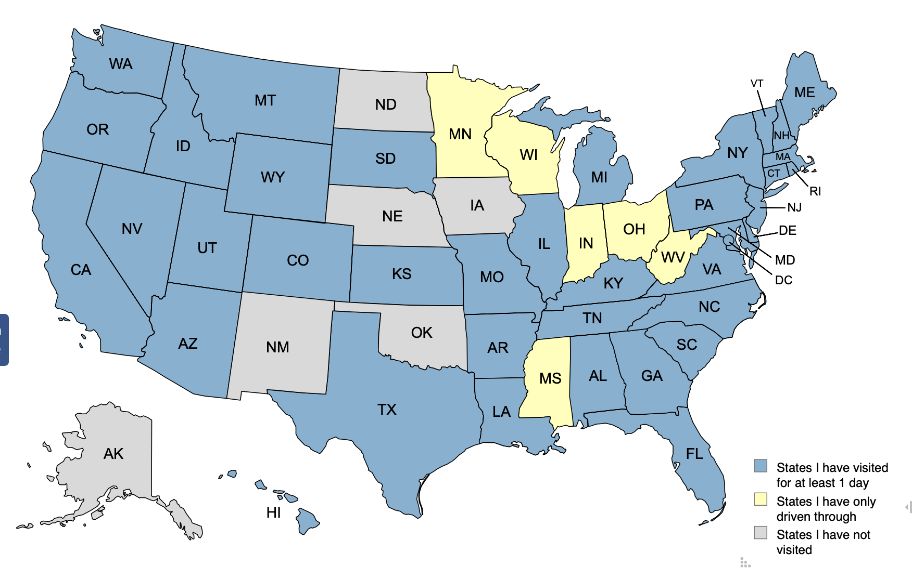
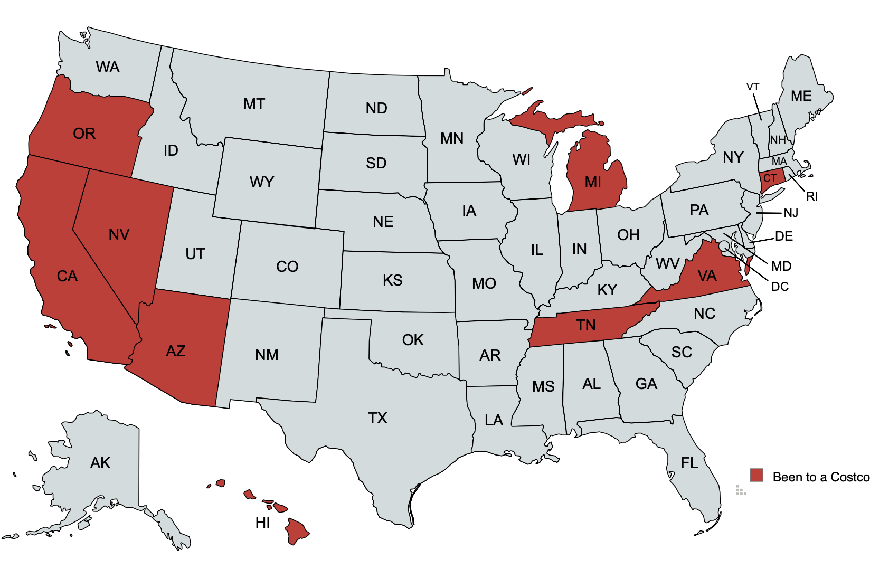

Originally from the East coast I first became fascinated in physics and astronomy
from watching Science/Discovery/History Channel documentaries on the space race. Always wanting to be
an astronaut, I've been chasing the stars ever since, but now safely from the ground in California. For more about my astro journey, see [my astro story](./myastrostory).

#### education

PhD in Physics - University of California, Irvine 2023
 
Masters in Physics - University of California, Irvine 2020
 
Bachelors in Physics and Applied Mathematics - Vanderbilt University 2016
 

#### a table of me

|          likes          |     dislikes      |    neutrals     |
|:------------------------|:------------------|:----------------|
| baseball                | untoasted bagels  | blue pens       |
| Bruce Springsteen       | neon colors       | mice            |
| wwii history books      | chalk             | lemon           |
| trains                  | bananas           | phone calls     |
| The Prestige            | wasps             | legal pad paper |

#### a comprehensive list of my favorite teams

NY Yankees, NY Football Giants, NY Rangers, Vanderbilt athletics

#### life accomplishments

one hole-in-three, 16/61 national parks, 19/30 baseball parks and 43*/50 states (see below)

#### Maps

I really like maps, so I thought I'd make a few. Click on the thumbnails on top to see the image enlarged below.

<html>
<meta name="viewport" content="width=480px, initial-scale=1">

<body>

  

    
  

  

    
  

  

    
  

  

    
  

  

    
  

  

    
  

  

    
1 / 6

    
  

  <!-- 

    

  
 -->

  

    
2 / 6

    
  

  

    
3 / 6

    
  

  

    
4 / 6

    
  

  

    
5 / 6

    
  

  

    
6 / 6

    
  

  <a class="prev" onclick="plusSlides(-1)">❮</a>
  <a class="next" onclick="plusSlides(1)">❯</a>

  <!--  -->
  

</body>
</html>

[Home](./)
