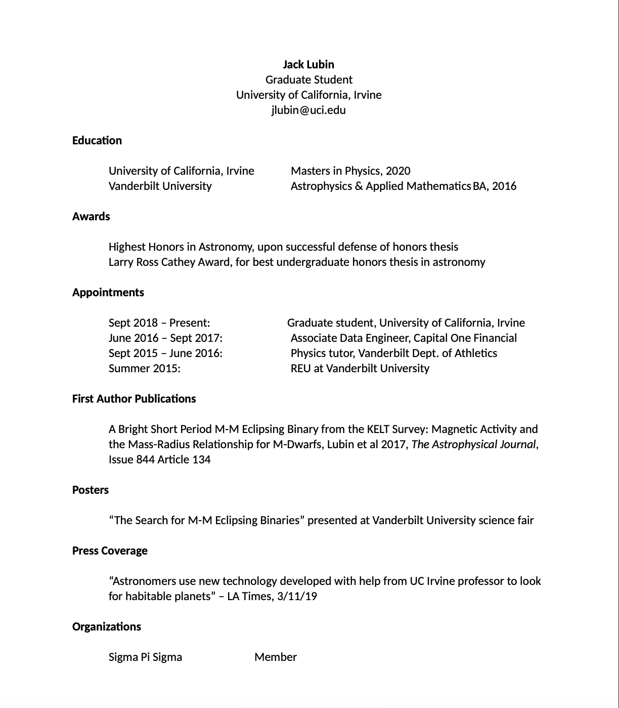

Here the first page of my CV, click to download the whole thing.

<!---->

 

And here is a my ORCID.

<a itemprop="sameAs" content="https://orcid.org/0000-0001-8342-7736" href="https://orcid.org/0000-0001-8342-7736" target="orcid.widget" rel="me noopener noreferrer" style="vertical-align:top;">https://orcid.org/0000-0001-8342-7736</a>

[Home](./)

<!--

 -->
