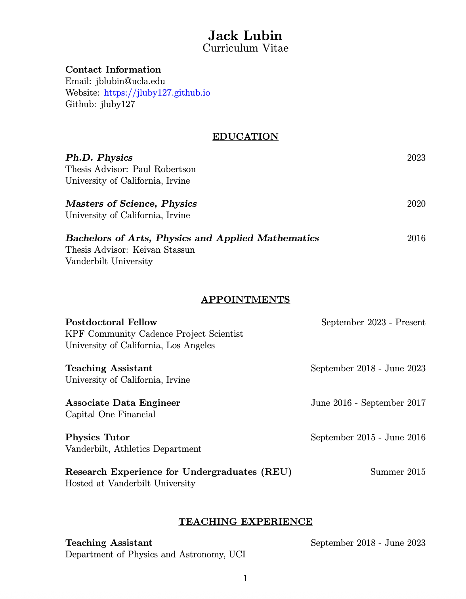
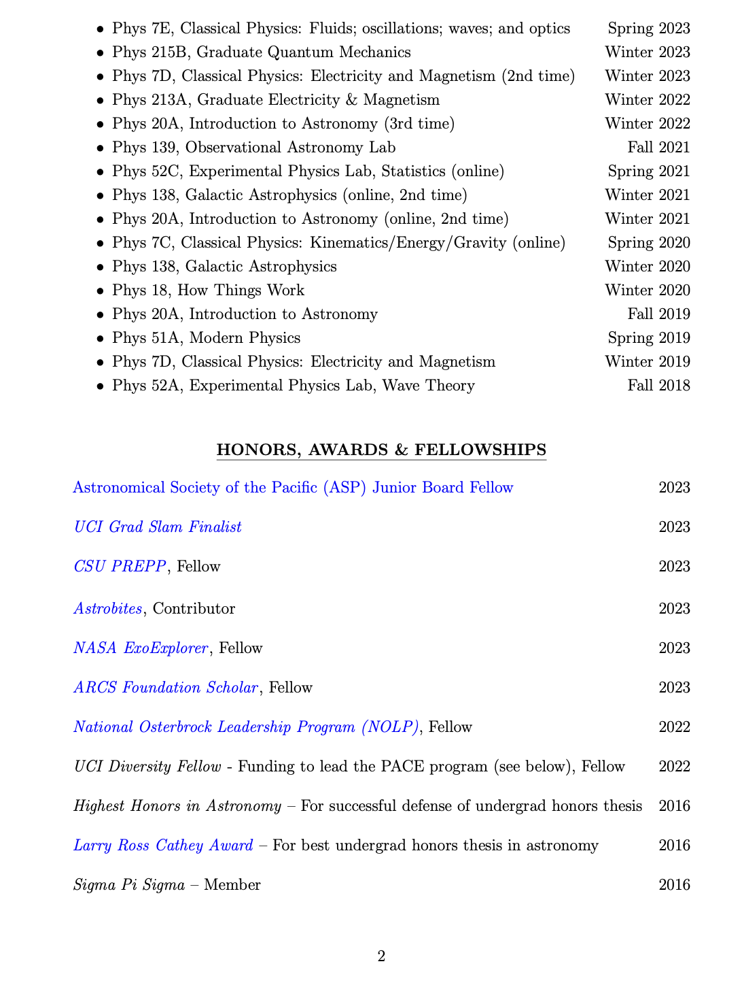
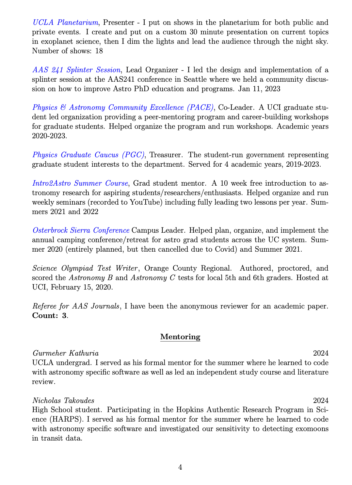
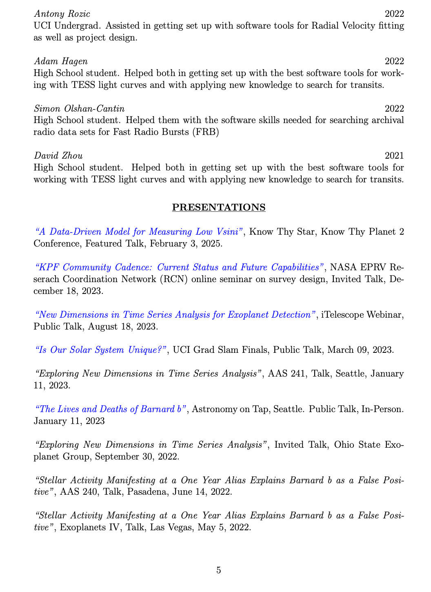

Here is both my regular CV and my "Failure" CV (see below)

Click on the first page to download the whole thing.

 

[My LinkedIn](https://www.linkedin.com/in/jack-lubin-6647a5105)

 

And here is a my ORCID.

<a itemprop="sameAs" content="https://orcid.org/0000-0001-8342-7736" href="https://orcid.org/0000-0001-8342-7736" target="orcid.widget" rel="me noopener noreferrer" style="vertical-align:top;">https://orcid.org/0000-0001-8342-7736</a>

And my "Failure" CV. Please read my note on the first page. And please consider constructing your own "Failure" CV. I believe our fields in science and more will be improved as they become more mainstream.

[Home](./)
