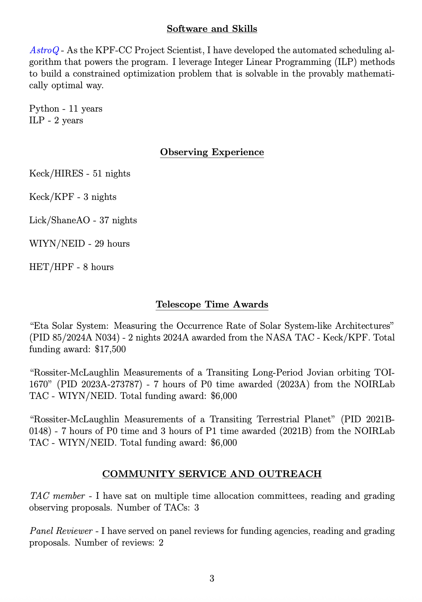
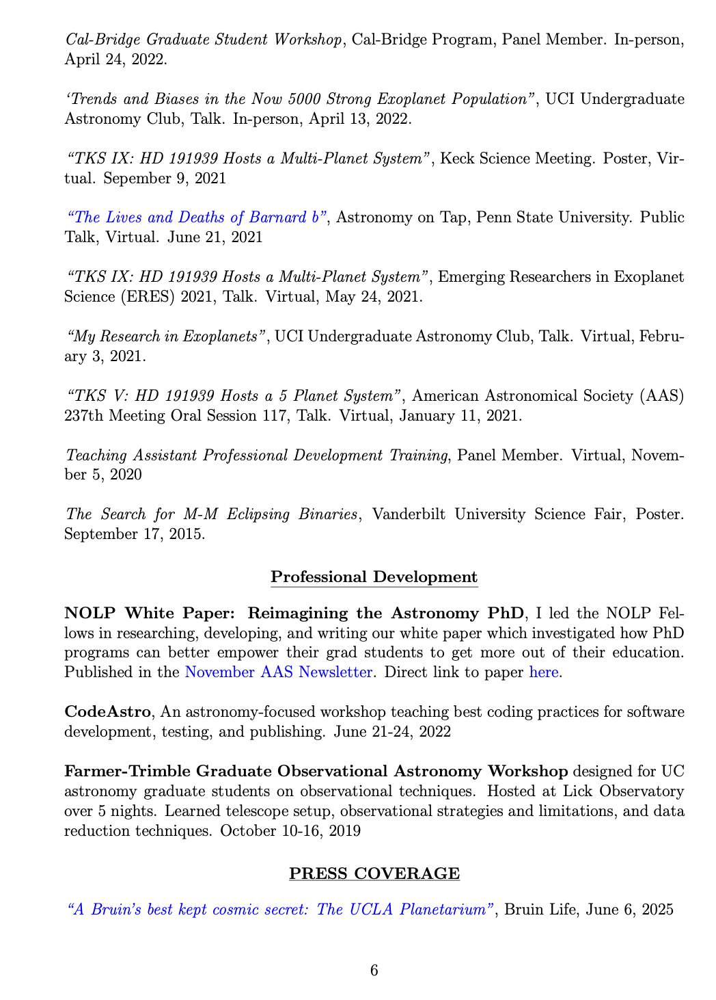
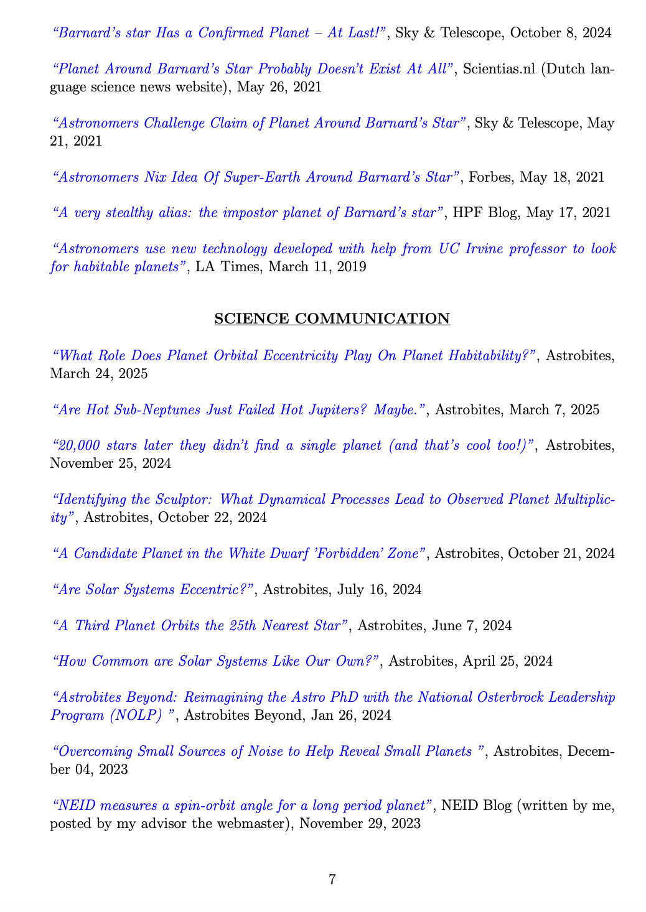

Here is my CV, click on the first page to download the whole thing.

<!---->

<!--
<a
  
</a>

<a
  
</a>

<a
  
</a>
-->

 

[My LinkedIn](https://www.linkedin.com/in/jack-lubin-6647a5105)

 

And here is a my ORCID.

<a itemprop="sameAs" content="https://orcid.org/0000-0001-8342-7736" href="https://orcid.org/0000-0001-8342-7736" target="orcid.widget" rel="me noopener noreferrer" style="vertical-align:top;">https://orcid.org/0000-0001-8342-7736</a>

Something that I only learned about recently (in ~Spring 2022) is called a "Failure CV". The CVs of successful professional scientists are very impressive. But, to me these CVs can be simultaneously very intimidating. These scientists have accomplished so much, how can I ever hope to do the same? To me, this brings on strong feeling of imposter syndrome, something that affects many scientists and people in many other fields too. But the Failure CV is supposed to combat this by publicly displaying a CV full of "failures": the schools you didn't get accepted to, the fellowships/grants that were denied, the missed opportunities...essentially all the things that arn't the impressive, well polished stats that go onto your CV. The idea is that by showing these kinds of "failures" in public, we acknowledge and and demonstrate how there is not one single path to success. And that a glowing CV is only the tip of the iceberg. I believe this can make our field more welcoming and inclusive, and I hope more people will join in on this movement. Below is my own "Failure CV".

[Home](./)
