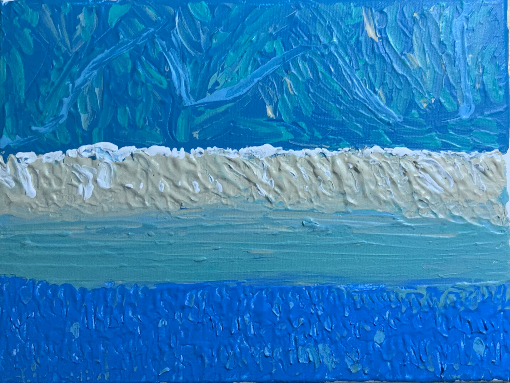
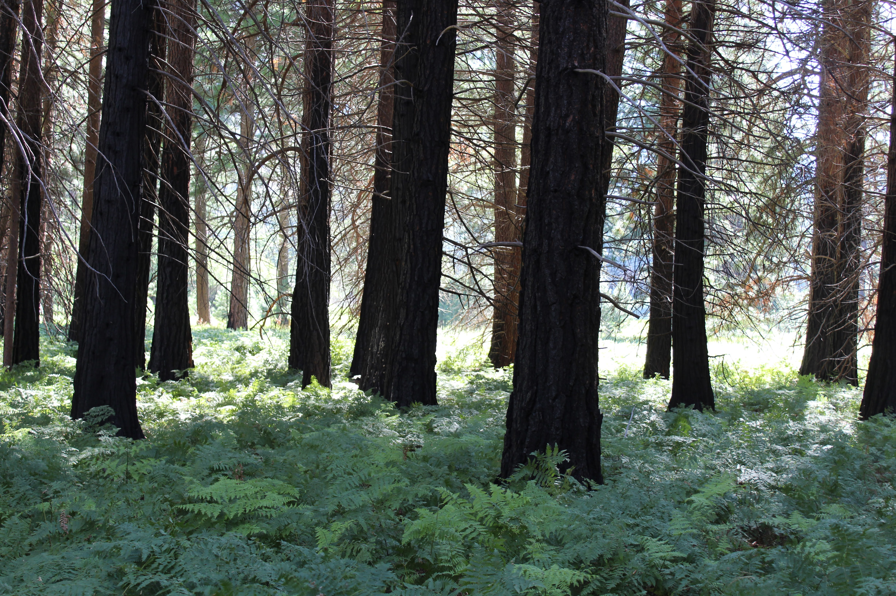

<html>
<head>
<meta name="viewport" content="width=device-width, initial-scale=1">

</head>
<body>

<!-- MAIN (Center website) -->

<h1>My Galleries</h1>

<h2>Art and Science are one and the same. While I pursue science professionally, I enjoy art recreationally. Here is my virtual gallery. I hope you enjoy!</h2>

<!-- Portfolio Gallery Grid -->

  

    

      
      <h3><a href="https://jluby127.github.io/galleries/gallery_paintings.html">Paintings</a></h3>
      
A virtual show room gallery of my painting hobby.

    

  

  

    

    
      <h3><a href="https://jluby127.github.io/galleries/writing.html">Short Stories</a></h3>
      
A virtual bookshelf for my hobby of writing sci-fi.

    

  

  

    

    
      <h3><a href="https://jluby127.github.io/galleries/gallery_nonfic.html">Non-Fiction</a></h3>
      
A virtual bookshelf for my aspirational goal to publish a non-fiction book.

    

  

  

    

    
      <h3><a href="https://jluby127.github.io/galleries/gallery_glacier.html">Photos: Glacier NP</a></h3>
      
My favorite 6 photos from Glacier National Park, July 2021.

    

  

<!-- END GRID -->
<!-- Portfolio Gallery Grid -->

  

    

      
      <h3><a href="https://jluby127.github.io/galleries/gallery_sequoia.html">Photos: Sequoia NP</a></h3>
      
My favorite 6 photos from Sequoia National Park, August 2022.

    

  

  

    

    
      <h3><a href="https://jluby127.github.io/galleries/gallery_joshua.html">Photos: Joshua NP</a></h3>
      
My favorite 6 photos from Joshua Tree National Park, February 2021.

    

  

  

    

    
      <h3>My Work</h3>
      
Lorem ipsum dolor sit amet, tempor prodesset eos no. Temporibus necessitatibus sea ei, at tantas oporteat nam. Lorem ipsum dolor sit amet, tempor prodesset eos no.

    

  

  

    

    
      <h3>My Work</h3>
      
Lorem ipsum dolor sit amet, tempor prodesset eos no. Temporibus necessitatibus sea ei, at tantas oporteat nam. Lorem ipsum dolor sit amet, tempor prodesset eos no.

    

  

<!-- END GRID -->
<!-- Portfolio Gallery Grid -->

  

    

      
      <h3>My Work</h3>
      
Lorem ipsum dolor sit amet, tempor prodesset eos no. Temporibus necessitatibus sea ei, at tantas oporteat nam. Lorem ipsum dolor sit amet, tempor prodesset eos no.

    

  

  

    

    
      <h3>My Work</h3>
      
Lorem ipsum dolor sit amet, tempor prodesset eos no. Temporibus necessitatibus sea ei, at tantas oporteat nam. Lorem ipsum dolor sit amet, tempor prodesset eos no.

    

  

  

    

    
      <h3>My Work</h3>
      
Lorem ipsum dolor sit amet, tempor prodesset eos no. Temporibus necessitatibus sea ei, at tantas oporteat nam. Lorem ipsum dolor sit amet, tempor prodesset eos no.

    

  

  

    

    
      <h3>My Work</h3>
      
Lorem ipsum dolor sit amet, tempor prodesset eos no. Temporibus necessitatibus sea ei, at tantas oporteat nam. Lorem ipsum dolor sit amet, tempor prodesset eos no.

    

  

<!-- END GRID -->

<!-- END MAIN -->

<!-- </body>
</html> -->

[Home](./)
