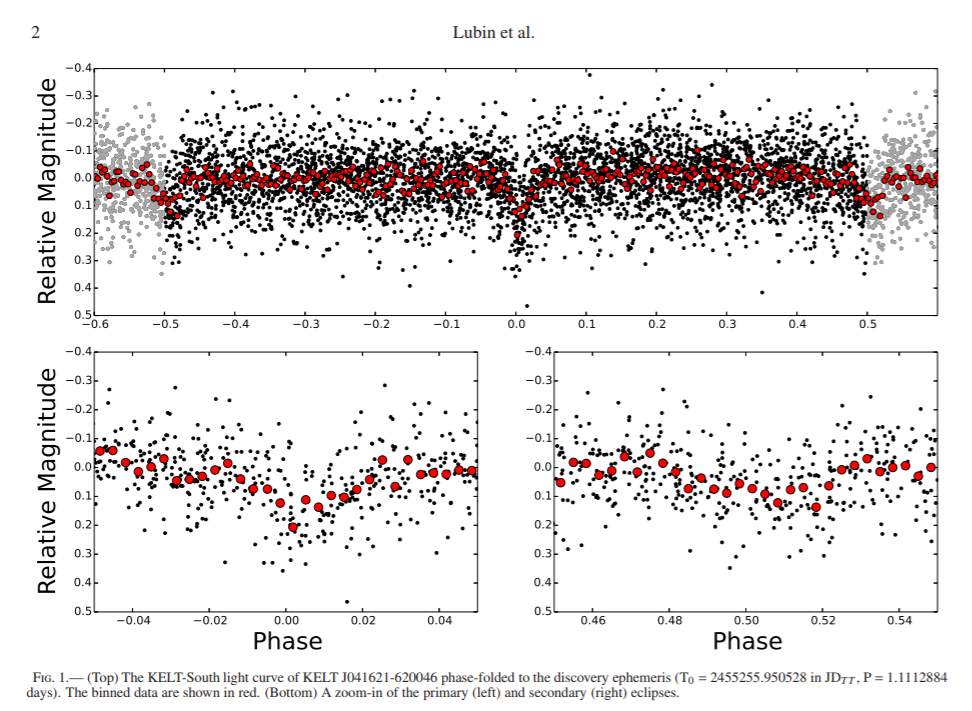

<strong>A little bit about my research</strong>

 
 
 

I primarily search for exoplanets using the radial velocity (RV) detection method but I am further interested in intersection of stellar activity and planet hunting. Stellar activity induced signals can mask or masquerade as planets. In this new era of high precision instrumentation which allows us to probe below the 1 m/s signal threshold, we are finding that such stellar activity will be a persistent nuisance in the search for low mass and/or long period planets.

Someday I might like to get my hands a little dirty with an instrumentation project...

Here I am at Cape Canaveral with friends test driving an Apollo capsule model. All systems go!  ----->
 
 
 
 
 

* * *

Here I am presenting My Research at the world-famous Desert Waterfall Theater.

 

I work with [Paul Robertson](https://faculty.sites.uci.edu/robertson/) on a variety of projects, such as:

<strong>Building a Better Periodogram:</strong>

Stellar activity is a real nuisance when planet hunting via RV. Activity induced signals,
from phenomena like star spots, can either mask a true planetary signal or mimic a planet causing false positive detections.
These signals are inherently tied to the rotation period of the star. The phenomena responsible have varying lifetimes and decay rates across different stellar classifications.
So how can we determine if a signal is planetary or activity without waiting years hoping that the signal won't disappear?
We need a better periodogram, one which can not only tell us the periodicity of a signal, but the decay time of the signal as well.

<strong>Spin-Orbit Misalignment:</strong>

As more planets are discovered and more can be fully characterized and scrutinized, astronomers are finding that planets don't always
align nicely with their star. That is to say the orbital plane of the planet is not exactly perpendicular to the axis of rotation of the host star. In our Solar System, the largest misalignment belongs to Mercury at just under 7 degrees.
But in extrasolar planets, astronomers are finding inclinations at every value between 0 and +/- 180 degrees (negative values indicate that the planet orbits in the opposite direction of the star's spin...a "backwards" or retrograde orbit).
This phenomena has important implications for our understanding of how planets form but more data is needed, we need more well measured systems.

<strong>And more...</strong>

 

I was the Winter 2021 quarter UCI Physics & Astronomy Department student spotlight! [Read all about it!](https://www.physastroblog.ps.uci.edu/2021/02/26/student-spotlight-jack-lubin/)

 

* * *

As an undergraduate at Vanderbilt, I worked with Professor [Keivan Stassun](http://astro.phy.vanderbilt.edu/~stassuk/) and (now Assistant Professor at Michigan State University) [Joseph Rodriguez](https://sites.google.com/site/josepherodriguezjr/) on double M dwarf eclipsing binaries.
We discovered and characterized the second brightest known of these such systems with the hope that the tight constraints we placed on mass, radius, and temperature can assist the theorists in refining their models of low mass stars.

# publications (most recent on top)

### first author

3. [TESS-Keck Survey IX: Masses of Three Sub-Neptunes Orbiting HD 191939 and the Discovery of a Warm Jovian Plus a Distant Sub-Stellar Companion](https://arxiv.org/abs/2108.02208)

2. [Stellar Activity Manifesting at a One Year Alias Explains Barnard b as a False Positive](https://arxiv.org/abs/2105.07005)

1. [A Bright Short Period M-M Eclipsing Binary from the KELT Survey: Magnetic Activity and the Mass-Radius Relationship for M-dwarfs](https://arxiv.org/abs/1706.02401)

### n author

19. [TOI 560 : Two Transiting Planets Orbiting a K Dwarf Validated with iSHELL, PFS and HIRES RVs](https://arxiv.org/abs/2112.13448)

18. [An eccentric Brown Dwarf eclipsing an M dwarf](https://arxiv.org/abs/2112.03959)

17. [SOLES II: The Aligned Orbit of WASP-148b, the Only Known Hot Jupiter with a Nearby Warm Jupiter Companion, from NEID and HIRES](https://arxiv.org/abs/2110.08832)

16. [HD207897 b: A dense sub-Neptune transiting a nearby and bright K-type star](https://arxiv.org/abs/2110.08597)

15. [TKS V. Twin sub-Neptunes Transiting the Nearby G Star HD 63935](https://arxiv.org/abs/2110.06885)

14. [The TESS-Keck Survey. VI. Two Eccentric sub-Neptunes Orbiting HIP-97166](https://arxiv.org/abs/2110.05628)

13. [Constraining the Orbit and Mass of ε Eridani b with Radial Velocities, Hipparcos IAD-{Gaia~DR2} Astrometry, and Multi-epoch Vortex Coronagraphy Upper Limits](https://arxiv.org/abs/2108.02305)

12. [A Second Planet Transiting LTT~1445A and a Determination of the Masses of Both Worlds](https://arxiv.org/abs/2107.14737)

11. [TOI-532b: The Habitable-zone Planet Finder confirms a Large Super Neptune in the Neptune Desert orbiting a metal-rich M dwarf host](https://arxiv.org/abs/2107.13670)

10. [The TESS-Keck Survey: Science Goals and Target Selection](https://arxiv.org/abs/2106.06156)

9. [TKS X: Confirmation of TOI-1444b and a Comparative Analysis of the Ultra-short-period Planets with Hot Neptunes](https://arxiv.org/abs/2105.08844)

8. [The TESS-Keck Survey IV: A Retrograde, Polar Orbit for the Ultra-Low-Density, Hot Super-Neptune WASP-107b](https://arxiv.org/abs/2101.09371)

7. [The TESS-Keck Survey II: Masses of Three Sub-Neptunes Transiting the Galactic Thick-Disk Star TOI-561](https://arxiv.org/abs/2009.03071)

6. [TKS III: A Stellar Obliquity Measurement of TOI-1726 c](https://arxiv.org/abs/2008.12397)

5. [A warm Jupiter transiting an M dwarf: A TESS single transit event confirmed with the Habitable-zone Planet Finder](https://arxiv.org/abs/2007.07098)

4. [Persistent starspot signals on M dwarfs: multi-wavelength Doppler observations with the Habitable-zone Planet Finder and Keck/HIRES](https://arxiv.org/abs/2005.09657)

3. [The multi-planet system TOI-421 -- A warm Neptune and a super puffy mini-Neptune transiting a G9 V star in a visual binary](https://arxiv.org/abs/2004.10095)

2. [TOI-1235 b: a keystone super-Earth for testing radius valley emergence models around early M dwarfs](https://arxiv.org/abs/2004.06682)

1. [The TESS-Keck Survey I: A Warm Sub-Saturn-mass Planet and a Caution about Stray Light in TESS Cameras](https://arxiv.org/abs/2003.10451)

 

<!--https://www.youtube.com/watch?v=_drHg6FpYmU -->

[Home](./)
