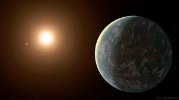

I primarily search for exoplanets using the radial velocity (RV) detection method and 
I have taken a particular fascination with multi-planet systems.

I am further interested in stellar activity as it relates to making planet detection more difficult,
and signal analysis/processing in general.

Someday I might light to get my hands a little dirty with an instrumentation project...

Here I am at Cape Canaveral with friends test driving an Apollo capsule model. All systems go! 
 
 
 
 
 
 
 
 
* * * 

 

I work with [Prof. Paul Robertson](https://faculty.sites.uci.edu/robertson/) on a variety of projects, such as:

Building a Better Periodogram: 

Stellar activity is a real nuisance when planet hunting via RV. Activity induced signals, 
from phenomena like star spots, can either mask a true planetary signal or mimic a planet causing false positive detections. 
These signals are inherentely tied to the rotation period of the star and have varying lifetimes. For example, a our sun
rotates once every 28 days and a star spot might live through 2 or 3 rotations. But on an old M Dwarf star, the rotation period is often greater than 100 days and the same spot can persist for 10+ rotations...that's on the timescale of years! 
So how can we determine if a signal is planetary or activity without waiting years hoping that the signal won't disappear? 
We need a better periodogram, one which can not only tell us the periodicity of a signal, but the decay time of the signal as well. 

Spin-Orbit Misalignment: 

As more planets are discovered and more can be fully characterized and scrutinized, astronomers are finding that planets don't always
align nicely with their star, that is to say the orbital plane of the planet is not exactly perpendicular to the axis of rotation of the host star. In our Solar System, the greatest planet-inclination (angle of misalignment) is Mercury at just under 7 degrees. 
But in extrasolar planets, astronomers are finding inclinations at every value between 0 and 180 degrees (between 90 and 180 means the planet orbits in the opposite direction of the star's spin...a "backwards" or retrograde orbit). 
This phenomena has important implications for our understanding of how planets form but more data is needed. Do Jupiters and Neptunes and Earths all follow similar trends in their inclinations? Does host star mass/temperature play a role?
We need more well measured systems.

more...

* * * 

Previously, as an undergraduate at Vanderbilt, I worked with Prof. Keivan Stassun and (now postdoc 
at Harvard CFA) Dr. Joseph Rodriguez on double M dwarf eclipsing binaries. 
we discovered and characterized the second brightest known of these such systems.

# publications

### first author

1. [A Bright Short Period M-M Eclipsing Binary from the KELT Survey: Magnetic Activity and the Mass-Radius Relationship for M-dwarfs](https://arxiv.org/abs/1706.02401)

### n author

<strong>n</strong>one

[home](./)
