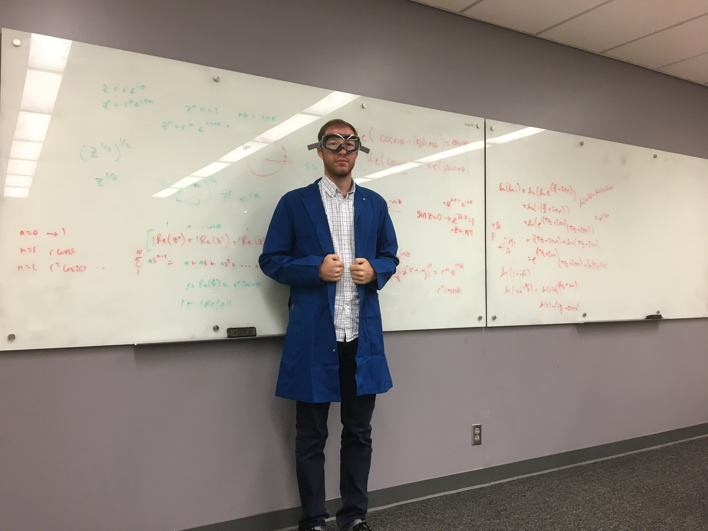

# Courses I've taught:
## [UCI Physics Course Catalog](http://catalogue.uci.edu/allcourses/physics/)

<figure>
 
</figure>

 

### Fall 2018: Physics 52A - Fundamentals of Experimental Physics Lab

Optics: lenses, mirrors, polarization, lasers, optical fibers, interference, spectra

 

### Winter 2019: Physics 7D - Classical Physics

Introduction to electricity and magnetism for scientists and engineers

 

### Spring 2019: Physics 51A -  Modern Physics

Wave-particle duality; quantum mechanics; special relativity; statistical mechanics

 

### Fall 2019: Physics 20A - Introduction to Astronomy

History of astronomy. Underlying physics. Objects in the solar system and how they are studied.
Properties of stars: their formation, structure, and evolution. Pulsars and black holes. Galaxies and quasars.

 

### Winter 2020: Physics 18 - How Things Work

Survey of the physical basis of modern technology, with an emphasis on electronics and materials. Topics include power generation and distribution, communication (radio, TV, telephone, computers, tape recorders, CD players), imaging (optics, x-rays, MRI), and modern materials (alloys, semiconductors, superconductors).

 

### Winter 2020: Physics 138 - Exragalactic Astrophysics

Introduction to the solar neighborhood, Milky Way, and other galaxies. Interstellar medium. Star formation. Stellar populations. Evolution of spiral, elliptical, and irregular galaxies. Supermassive black holes, quasars, and active galaxies. Galaxies as probes of the expansion rate of the Universe.

 

### Spring 2020: Physics 7C - Classical Physics

Introduction to force, energy, momentum, rotation, and gravity for scientists and engineers.

 

### Fall 2020: Physics 14 - Energy and the Environment

The physics of society’s energy production and consumption, and of their influences on the environment. Topics include fossil and renewable energy resources; nuclear power; prospects for a hydrogen economy; efficient and environmentally benign transportation; efficient home and commercial energy usage.

 

### Winter 2021: Physics 20A - Introduction to Astronomy

History of astronomy. Underlying physics. Objects in the solar system and how they are studied. Properties of stars: their formation, structure, and evolution. Pulsars and black holes. Galaxies and quasars.

 

### Winter 2021: Physics 138 - Extragalactic Astrophysics (2nd time)

Introduction to the solar neighborhood, Milky Way, and other galaxies. Interstellar medium. Star formation. Stellar populations. Evolution of spiral, elliptical, and irregular galaxies. Supermassive black holes, quasars, and active galaxies. Galaxies as probes of the expansion rate of the Universe.

 

[home](./)
